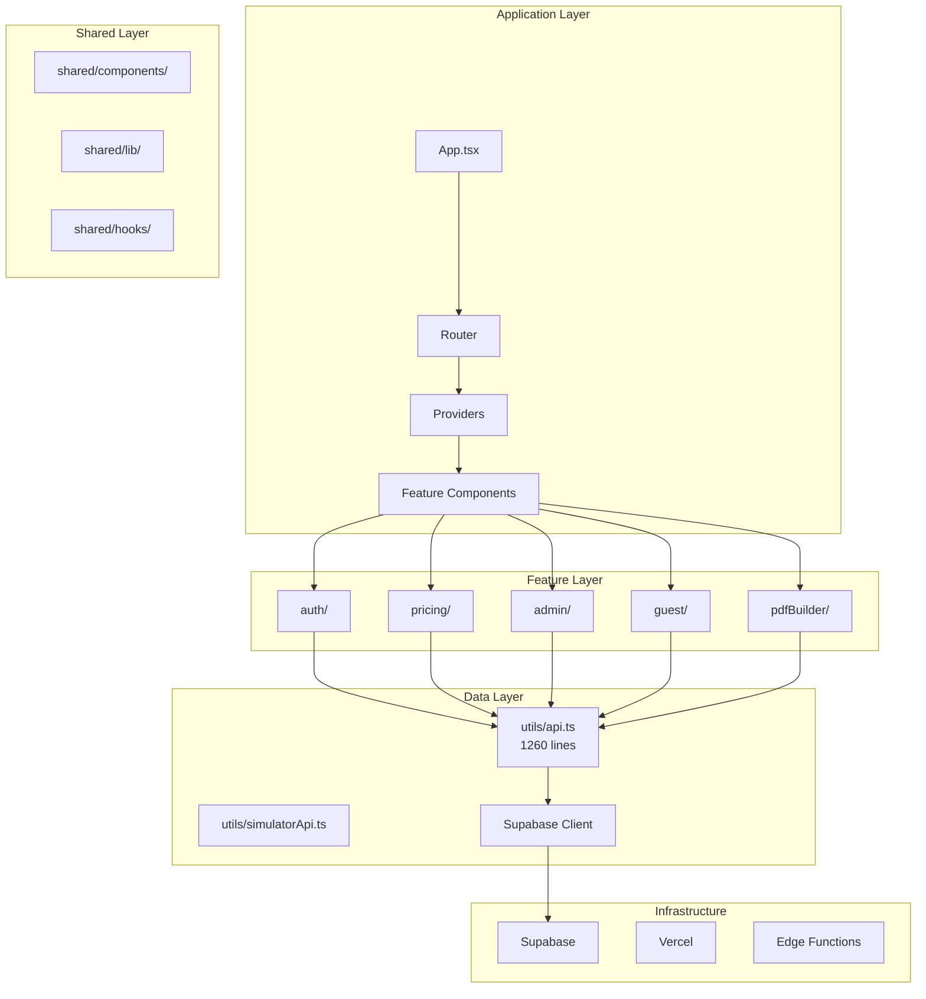
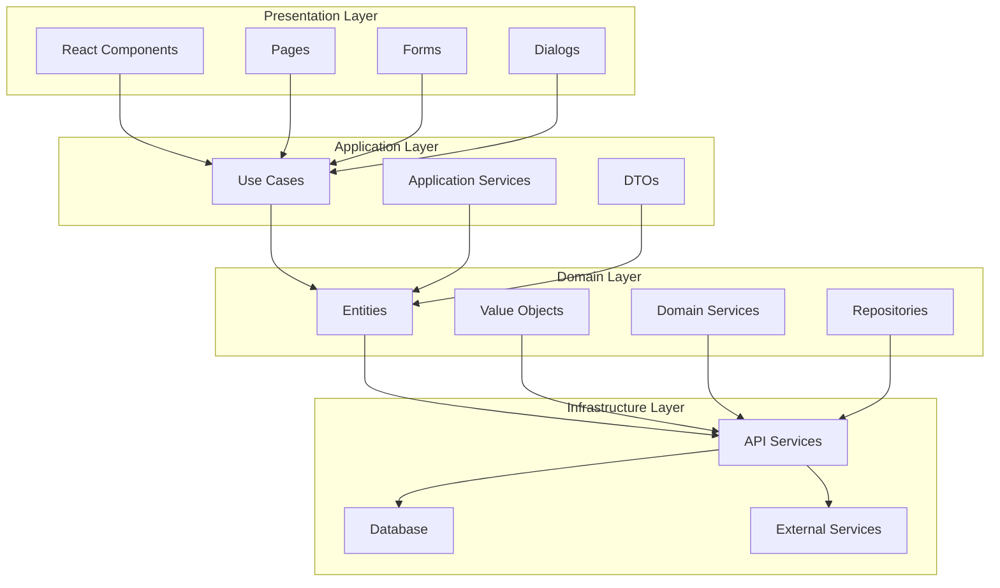
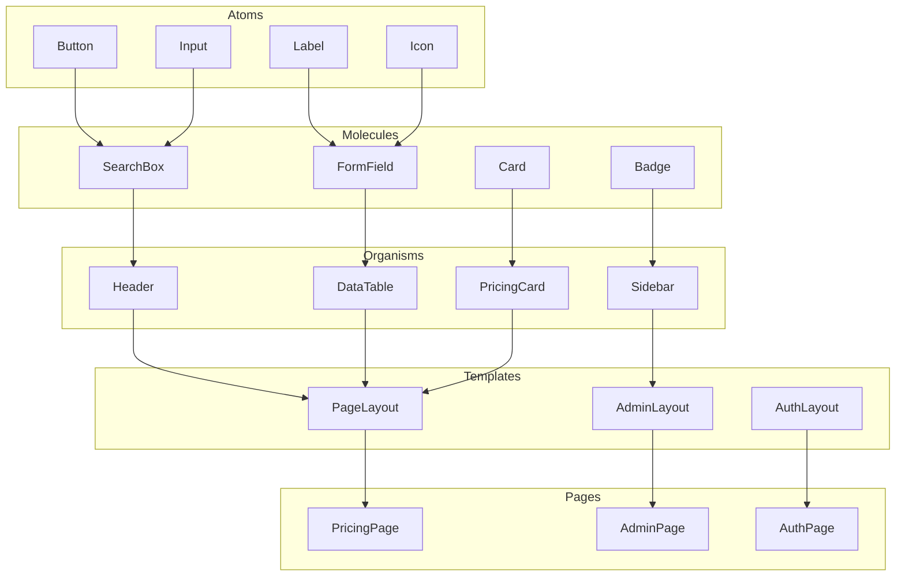

# areeba Pricing Simulator - Architecture Analysis

## Executive Summary

This document provides a comprehensive analysis of the areeba Pricing Simulator codebase architecture, identifying current patterns, dependencies, and opportunities for restructuring. The application is a React-based pricing simulator with a feature-based architecture, but shows signs of architectural debt that could benefit from restructuring.

## Current Architecture Overview

### Technology Stack
- **Frontend**: React 18 + TypeScript + Vite
- **UI Framework**: shadcn/ui (Radix UI + Tailwind CSS)
- **Routing**: React Router v6
- **Backend**: Supabase (PostgreSQL + Auth + Edge Functions)
- **State Management**: React Context + Custom Hooks
- **Testing**: Vitest + React Testing Library + Playwright

### High-Level Architecture

```
┌─────────────────────────────────────────────────────────────┐
│                    Application Layer                         │
├─────────────────────────────────────────────────────────────┤
│  App.tsx → Router → Providers → Feature Components          │
├─────────────────────────────────────────────────────────────┤
│                    Feature Layer                            │
├─────────────────────────────────────────────────────────────┤
│  auth/ │ pricing/ │ admin/ │ guest/ │ pdfBuilder/           │
├─────────────────────────────────────────────────────────────┤
│                    Shared Layer                             │
├─────────────────────────────────────────────────────────────┤
│  shared/components/ │ shared/lib/ │ shared/hooks/          │
├─────────────────────────────────────────────────────────────┤
│                    Data Layer                               │
├─────────────────────────────────────────────────────────────┤
│  utils/api.ts │ utils/simulatorApi.ts │ Supabase Client     │
├─────────────────────────────────────────────────────────────┤
│                    Infrastructure                           │
├─────────────────────────────────────────────────────────────┤
│  Supabase │ Vercel │ Edge Functions │ Database              │
└─────────────────────────────────────────────────────────────┘
```

## Detailed Architecture Analysis

### 1. Feature Organization

#### Current Feature Structure
```
src/features/
├── auth/                    # Authentication & User Management
│   ├── components/          # LoginForm, SignupForm, UserProfile
│   ├── hooks/              # useAuth, useAuthValidation
│   ├── api/                # AuthService
│   └── types.ts            # Auth-specific types
├── pricing/                # Core Pricing Logic
│   ├── components/         # FeeSummary, PricingItemCard
│   ├── hooks/              # usePricingItems, usePricingCalculation
│   └── api/                # PricingService
├── admin/                  # Administrative Functions
│   ├── components/          # AdminDashboard, AdminUsersTable
│   ├── hooks/              # useAdminStats, useAdminUsers
│   └── api/                # AdminService
├── guest/                  # Guest User Functionality
│   ├── components/         # GuestContactForm, GuestSubmissionModal
│   ├── hooks/              # useGuestSession, useGuestValidation
│   └── api/                # GuestService
└── pdfBuilder/            # PDF Generation & Management
    ├── components/         # 25+ PDF-related components
    ├── hooks/              # usePdfBuilder
    └── api/                # PdfBuilderService
```

#### Strengths
- **Clear Feature Boundaries**: Each feature has its own components, hooks, and API layer
- **Consistent Structure**: All features follow the same organizational pattern
- **Separation of Concerns**: Business logic is separated from UI components

#### Issues
- **Feature Bloat**: pdfBuilder has 25+ components, suggesting it might be too large
- **Inconsistent Dependencies**: Some features depend on others (e.g., admin depends on pricing)
- **Shared Logic Duplication**: Similar patterns repeated across features

### 2. Component Architecture

#### Current Component Organization
```
src/components/             # Legacy components (112 files)
├── ui/                     # shadcn/ui components (51 files)
├── dialogs/                # Modal components (9 files)
├── layout/                 # Header, Footer, Layout components
└── [various]               # Business logic components

src/shared/components/      # Shared components
├── ui/                     # Duplicate shadcn/ui components
└── [accessibility]         # AccessibleButton, AccessibleForm
```

#### Component Patterns Identified

1. **Container/Presentational Pattern**
   - `PricingSimulator` (container) → `ScenarioBuilder` (presentational)
   - `AdminInterface` (container) → Various admin components

2. **Compound Component Pattern**
   - `Header` with multiple variants (public, admin, simulator)
   - `Sidebar` with multiple sub-components

3. **Render Props Pattern**
   - `ErrorBoundary` with fallback rendering
   - `Suspense` boundaries for lazy loading

#### Issues
- **Component Duplication**: UI components exist in both `components/ui/` and `shared/components/ui/`
- **Large Components**: `PricingSimulator.tsx` (589 lines), `AdminInterface.tsx` (complex)
- **Mixed Responsibilities**: Some components handle both UI and business logic
- **Inconsistent Patterns**: Different patterns used for similar functionality

### 3. Data Flow Architecture

#### Current Data Flow
```
User Interaction → Component → Hook → Service → API → Database
                ↓
            State Update → Re-render → UI Update
```

#### State Management Patterns

1. **React Context + Custom Hooks**
   ```typescript
   // Auth Context
   const { user, isAuthenticated, login, logout } = useAuth();
   
   // Pricing Context
   const { selectedItems, addItem, removeItem } = usePricingItems();
   ```

2. **Local State with Props Drilling**
   ```typescript
   // PricingSimulator passes data down to children
   <ScenarioBuilder 
     selectedItems={selectedItems}
     onUpdateItem={onUpdateItem}
     clientConfig={clientConfig}
   />
   ```

3. **Service Layer Pattern**
   ```typescript
   // Direct API calls through service classes
   const items = await PricingService.getItems();
   const user = await AuthService.getCurrentUser();
   ```

#### Issues
- **Props Drilling**: Deep component trees require extensive prop passing
- **State Synchronization**: Multiple sources of truth for related data
- **Cache Management**: No centralized caching strategy
- **Error Handling**: Inconsistent error handling across features

### 4. API Architecture

#### Current API Structure
```
src/utils/
├── api.ts                  # Main API (1260 lines) - MONOLITHIC
├── simulatorApi.ts         # Simulator-specific API
└── supabase/
    └── client.ts           # Supabase client configuration

src/features/*/api/
├── authService.ts          # Auth API calls
├── pricingService.ts       # Pricing API calls
├── adminService.ts         # Admin API calls
├── guestService.ts         # Guest API calls
└── pdfBuilderService.ts   # PDF Builder API calls
```

#### API Patterns

1. **Monolithic API** (`utils/api.ts`)
   - 1260 lines of mixed responsibilities
   - Direct Supabase queries
   - No abstraction layer

2. **Feature-Specific Services**
   - Each feature has its own service class
   - Consistent patterns across services
   - Type-safe API calls

#### Issues
- **API Duplication**: Similar queries in multiple services
- **No Caching**: Every API call hits the database
- **Error Handling**: Inconsistent error handling patterns
- **Type Safety**: Some API calls lack proper typing

### 5. Dependency Analysis

#### Current Dependencies
```
App.tsx
├── Router (lazy-loaded components)
├── Providers (Auth, Theme, Error Boundary)
└── Features
    ├── auth/ (independent)
    ├── pricing/ (depends on auth)
    ├── admin/ (depends on auth, pricing)
    ├── guest/ (independent)
    └── pdfBuilder/ (depends on auth, pricing)
```

#### Coupling Issues
- **Tight Coupling**: Components directly import from other features
- **Circular Dependencies**: Some features depend on each other
- **Shared Dependencies**: Multiple features depend on the same utilities
- **Global State**: Auth state is accessed throughout the application

## Architectural Issues Identified

### 1. **Monolithic Components**
- `PricingSimulator.tsx` (589 lines) - Too many responsibilities
- `AdminInterface.tsx` - Complex sidebar with mixed concerns
- `api.ts` (1260 lines) - Monolithic API layer

### 2. **Inconsistent Patterns**
- Mixed component patterns (container/presentational vs compound)
- Inconsistent state management (Context vs local state)
- Different error handling approaches

### 3. **Code Duplication**
- UI components duplicated between `components/ui/` and `shared/components/ui/`
- Similar API patterns repeated across services
- Duplicate type definitions

### 4. **Poor Separation of Concerns**
- Business logic mixed with UI components
- API logic mixed with presentation logic
- Configuration scattered across files

### 5. **Testing Challenges**
- Large components are difficult to test
- Tight coupling makes unit testing complex
- No clear testing boundaries

## Restructuring Recommendations

### 1. **Implement Domain-Driven Design (DDD)**

#### Proposed Structure
```
src/
├── domains/                    # Business domains
│   ├── pricing/               # Core pricing domain
│   │   ├── entities/           # PricingItem, Category, etc.
│   │   ├── services/           # Domain services
│   │   ├── repositories/       # Data access layer
│   │   └── use-cases/          # Business use cases
│   ├── user-management/        # User and auth domain
│   ├── document-generation/   # PDF generation domain
│   └── analytics/             # Analytics and reporting
├── shared/                     # Shared infrastructure
│   ├── components/            # Reusable UI components
│   ├── hooks/                 # Shared hooks
│   ├── services/              # Infrastructure services
│   └── utils/                 # Utility functions
└── app/                       # Application layer
    ├── pages/                 # Page components
    ├── routing/               # Route definitions
    └── providers/             # Context providers
```

### 2. **Implement Clean Architecture**

#### Layer Structure
```
┌─────────────────────────────────────────────────────────────┐
│                    Presentation Layer                       │
├─────────────────────────────────────────────────────────────┤
│  React Components │ Pages │ Forms │ Dialogs                 │
├─────────────────────────────────────────────────────────────┤
│                    Application Layer                        │
├─────────────────────────────────────────────────────────────┤
│  Use Cases │ Application Services │ DTOs                     │
├─────────────────────────────────────────────────────────────┤
│                    Domain Layer                              │
├─────────────────────────────────────────────────────────────┤
│  Entities │ Value Objects │ Domain Services │ Repositories  │
├─────────────────────────────────────────────────────────────┤
│                    Infrastructure Layer                      │
├─────────────────────────────────────────────────────────────┤
│  API Services │ Database │ External Services                │
└─────────────────────────────────────────────────────────────┘
```

### 3. **Component Architecture Improvements**

#### Proposed Component Structure
```
src/
├── components/                # Atomic components
│   ├── atoms/                # Basic UI elements
│   ├── molecules/            # Simple combinations
│   ├── organisms/            # Complex components
│   └── templates/            # Page layouts
├── features/                 # Feature-specific components
│   ├── pricing/             # Pricing feature components
│   ├── auth/                # Auth feature components
│   └── admin/               # Admin feature components
└── pages/                    # Page components
    ├── PricingPage.tsx
    ├── AdminPage.tsx
    └── AuthPage.tsx
```

### 4. **State Management Improvements**

#### Proposed State Architecture
```
src/
├── store/                    # Centralized state management
│   ├── slices/               # Feature-specific state slices
│   │   ├── authSlice.ts      # Auth state
│   │   ├── pricingSlice.ts   # Pricing state
│   │   └── uiSlice.ts        # UI state
│   ├── middleware/            # Custom middleware
│   └── store.ts              # Store configuration
├── services/                 # Service layer
│   ├── api/                  # API services
│   ├── cache/                # Caching services
│   └── storage/              # Storage services
```

### 5. **API Architecture Improvements**

#### Proposed API Structure
```
src/
├── api/                      # API layer
│   ├── clients/              # API clients
│   │   ├── supabaseClient.ts
│   │   └── httpClient.ts
│   ├── endpoints/            # API endpoints
│   │   ├── auth.ts
│   │   ├── pricing.ts
│   │   └── admin.ts
│   ├── types/                # API types
│   └── utils/                # API utilities
├── services/                 # Business services
│   ├── AuthService.ts
│   ├── PricingService.ts
│   └── AdminService.ts
```

## Migration Strategy

### Phase 1: Foundation (Weeks 1-2)
1. **Create new directory structure**
2. **Set up state management (Zustand/Redux Toolkit)**
3. **Implement API client abstraction**
4. **Create shared component library**

### Phase 2: Domain Migration (Weeks 3-6)
1. **Migrate pricing domain**
2. **Migrate auth domain**
3. **Migrate admin domain**
4. **Update routing and navigation**

### Phase 3: Component Refactoring (Weeks 7-10)
1. **Break down monolithic components**
2. **Implement atomic design system**
3. **Refactor shared components**
4. **Update component tests**

### Phase 4: API Refactoring (Weeks 11-12)
1. **Implement API abstraction layer**
2. **Add caching layer**
3. **Implement error handling**
4. **Update API tests**

### Phase 5: Testing & Optimization (Weeks 13-14)
1. **Add comprehensive tests**
2. **Performance optimization**
3. **Bundle optimization**
4. **Documentation updates**

## Benefits of Restructuring

### 1. **Improved Maintainability**
- Clear separation of concerns
- Easier to locate and modify code
- Reduced coupling between modules

### 2. **Better Testability**
- Smaller, focused components
- Clear testing boundaries
- Easier to mock dependencies

### 3. **Enhanced Scalability**
- Easy to add new features
- Reusable components and services
- Clear architectural patterns

### 4. **Developer Experience**
- Consistent patterns across the codebase
- Better IDE support and autocomplete
- Clearer code organization

### 5. **Performance Improvements**
- Better code splitting opportunities
- Reduced bundle size
- Improved caching strategies

## Visual Architecture Diagrams

### Current Architecture


### Proposed Clean Architecture


### Component Architecture (Atomic Design)


## Conclusion

The current architecture shows good intentions with feature-based organization, but suffers from technical debt and inconsistent patterns. The proposed restructuring would significantly improve maintainability, testability, and scalability while providing a clear path for future development.

The migration strategy allows for incremental improvements without disrupting the current functionality, making it a practical approach for a production application.
